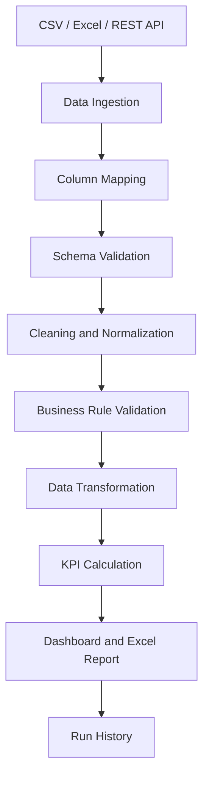

# RetailFlow Analytics

**Automated sales, inventory and returns reporting for small retail businesses.**

RetailFlow Analytics converts raw CSV, Excel and optional REST API data into a
validated Excel management report. It replaces a repetitive manual reporting
process: a user can load business files, review data-quality problems, analyse
performance in a Streamlit dashboard and generate a traceable management workbook.

> **Dashboard screenshot placeholder:** `screenshots/04_dashboard.png` has not been
> captured yet. The repository currently keeps only `screenshots/.gitkeep`, so no
> broken image is embedded here.

> **Status:** This is a working portfolio application intended for local and Docker
> demonstrations. Its ingestion, validation, transformation, analytics, reporting,
> CLI, mock API and local run-history workflows are implemented and covered by tests.

## Business Problem

Small retail teams often receive orders, product catalogues, stock records and
returns in separate files. Producing a management pack then requires repeated manual
column matching, spreadsheet cleanup, cross-file checks, KPI calculations and chart
updates. That process is slow, difficult to audit and vulnerable to unnoticed data
quality problems.

## Solution

RetailFlow Analytics provides one controlled workflow for those tasks. It maps source
columns to a canonical schema, records validation issues, normalizes values, excludes
blocking rows according to configuration, joins datasets without multiplying order
rows and calculates sales, returns and inventory measures. The reviewed result feeds
the interactive dashboard and a formatted Excel workbook, while SQLite retains a
small metadata record for each report-generation attempt.

## Key Features

- CSV and XLSX ingestion from paths, byte streams and Streamlit uploads.
- Optional authenticated, paginated REST ingestion with retry and timeout handling.
- Automatic column normalization, configurable aliases and manual mapping overrides.
- Structural, data-type, relationship and business-rule validation.
- Rule-based data-quality scoring with issue and excluded-row exports.
- Cleaning for identifiers, dates, numeric formats, percentages, countries,
  currencies, order statuses and sales channels.
- Sales, returns and inventory KPIs with shared dashboard filters and prior-period
  comparisons.
- Transparent, deterministic recommendations; no generative AI service is used.
- Multi-sheet Excel management reports with tables, charts, formatting and metadata.
- Streamlit pages for upload, quality review, dashboard, report generation and run
  history.
- Typer CLI for validation, report generation, configuration inspection and demo data.
- SQLAlchemy run-history repository backed by SQLite by default.
- Reproducible Docker and Docker Compose setup running as a non-root user.

## Demo

The quickest complete local demonstration uses deterministic clean data:

```bash
python -m retailflow generate-demo-data \
  --output-directory demo_data \
  --random-seed 42 \
  --exclude-invalid-rows
python -m streamlit run app/main.py
```

Open <http://localhost:8501>, then follow **Upload Data → Data Quality → Dashboard →
Generate Report**. To demonstrate error handling instead, regenerate the files with
`--include-invalid-rows`, which intentionally introduces a small set of known data
quality problems.

## Screenshots

No screenshot files have been committed yet. These are the planned capture paths;
each is deliberately shown as a placeholder rather than as a broken Markdown image.

| Expected path | Intended view | Current status |
| --- | --- | --- |
| `screenshots/01_overview.png` | Product overview | Placeholder — not captured |
| `screenshots/02_upload.png` | File and API upload workflow | Placeholder — not captured |
| `screenshots/03_data_quality.png` | Validation summary and issue review | Placeholder — not captured |
| `screenshots/04_dashboard.png` | Filtered KPI dashboard | Placeholder — not captured |
| `screenshots/05_excel_summary.png` | Excel executive summary | Placeholder — not captured |
| `screenshots/06_inventory_report.png` | Excel inventory analysis | Placeholder — not captured |

## System Architecture



The reusable application code lives in `src/retailflow`. Streamlit pages call service
modules under `app/services`, while the CLI calls the same ingestion, processing,
analytics, reporting and storage layers. The local FastAPI application in `mock_api`
is a demonstration data source, not a second business pipeline.

## Data Pipeline

1. Read Orders, Products, Inventory, Returns and optional Monthly Targets sources.
2. Normalize headings and apply exact, alias or user-supplied column mappings.
3. Check that required canonical columns are present and unambiguous.
4. Normalize strings, numbers, percentages and dates; record conversion issues.
5. Apply dataset-specific validation and cross-dataset relationship rules.
6. Handle duplicates and exclude blocking rows according to application settings.
7. Join orders to products, returns to orders/products, inventory to products and
   targets to reporting months with join-cardinality safeguards.
8. Preserve source filename, source row number, processing status and exclusion
   reason for traceability.
9. Calculate filtered KPIs, inventory measures, comparisons and recommendations.
10. Present the result in Streamlit, write the Excel report and retain run metadata.

## Technology Stack

| Area | Implementation |
| --- | --- |
| Runtime | Python 3.12 |
| Data processing | pandas |
| Configuration and schemas | Pydantic, pydantic-settings, PyYAML |
| Web interface | Streamlit, Plotly |
| Excel | XlsxWriter, openpyxl |
| Persistence | SQLAlchemy, SQLite |
| REST integration | requests, FastAPI, Uvicorn |
| CLI | Typer |
| Quality tooling | pytest, pytest-cov, Ruff, Mypy |
| Packaging and runtime | setuptools, Docker, Docker Compose |

## Quick Start

Python 3.12 is required.

```bash
python3.12 -m venv .venv
source .venv/bin/activate
python -m pip install --upgrade pip
python -m pip install -e ".[dev]"
python -m retailflow generate-demo-data \
  --output-directory demo_data \
  --exclude-invalid-rows
python -m streamlit run app/main.py
```

In another terminal, a complete CLI report can be generated from the same files:

```bash
source .venv/bin/activate
python -m retailflow generate \
  --orders demo_data/orders.csv \
  --products demo_data/products.xlsx \
  --inventory demo_data/inventory.csv \
  --returns demo_data/returns.xlsx \
  --targets demo_data/monthly_targets.csv \
  --period 2025-01 \
  --currency EUR \
  --output output
```

Run the test suite with:

```bash
python -m pytest
```

Or start the containerized application:

```bash
docker compose up --build
```

## Local Development

The Makefile wraps the verified project commands:

```bash
make install       # install the package and development dependencies
make test          # run pytest with terminal and XML coverage output
make lint          # run Ruff checks
make format        # format Python files with Ruff
make typecheck     # run strict Mypy checks for src and app
make check         # lint, type-check and test
make run           # launch Streamlit on its default port
make demo-data     # generate demo files, including intentional invalid rows
```

Ruff and Mypy target Python 3.12. Pytest discovers tests under `tests/`, writes
`coverage.xml` and enforces the configured 85% coverage floor.

## Docker

Build and start Streamlit at <http://localhost:8501>:

```bash
docker compose up --build
```

The image uses the official Python 3.12 slim base, runs as the non-root
`retailflow` user and checks Streamlit's `/_stcore/health` endpoint. Named volumes
persist reports, SQLite data and optional demo files across container replacement:

| Volume | Container path | Purpose |
| --- | --- | --- |
| `retailflow-reports` | `/app/output` | Generated workbooks |
| `retailflow-database` | `/app/data` | SQLite run history |
| `retailflow-demo-data` | `/app/demo_data` | Optional generated sources |

Generate demo files on first container startup with:

```bash
RETAILFLOW_GENERATE_DEMO_DATA=true docker compose up --build
```

The optional mock API uses a Compose profile and host port 8000:

```bash
export RETAIL_API_TOKEN=retailflow-demo-token
docker compose --profile mock-api up --build
```

The documented token is for the local mock only. Override `RETAILFLOW_PORT`,
`RETAILFLOW_MOCK_API_PORT` or `RETAILFLOW_DOCKER_API_URL` when required. The
equivalent lifecycle commands are `make docker-build`, `make docker-up`,
`make docker-logs` and `make docker-down`. `docker compose down` keeps named volumes;
adding `--volumes` deletes them.

## CLI Usage

Display the command catalogue with:

```bash
python -m retailflow --help
```

Implemented commands are:

- `generate` — process sources, calculate analytics, create a report and save run
  history.
- `validate` — process sources and print row counts, issue counts and quality score;
  optionally write a validation-only workbook.
- `generate-demo-data` — create reproducible CSV/XLSX source files.
- `show-config` — print effective configuration with sensitive values removed.
- `version` — print the installed application version.

Configuration-based use:

```bash
python -m retailflow validate --config config/config.example.yaml
python -m retailflow generate \
  --config config/config.example.yaml \
  --period 2025-01
```

`generate` also accepts `--currency`, `--overwrite`, `--strict` and `--debug`.
Strict mode stops report creation when warnings exist unless configuration explicitly
allows a report despite that failure. Tracebacks are hidden unless `--debug` is used.

Stable CLI exit codes are:

| Code | Meaning |
| ---: | --- |
| 0 | Success |
| 2 | Configuration error |
| 3 | Source-file error |
| 4 | Validation failure |
| 5 | Report-generation failure |
| 10 | Unexpected internal error |

## REST API Integration

The optional client loads Orders, Products, Inventory and Returns from authenticated,
paginated endpoints. It supports separate connect/read timeouts, exponential backoff,
`Retry-After`, retryable connection/timeout/429/selected 5xx failures, schema checks
and cooperative cancellation. Authentication failures, invalid requests and schema
mismatches are not retried. Monthly Targets remain an optional file source and are not
served by the mock API.

Start the local demonstration API:

```bash
cp .env.example .env
set -a
source .env
set +a
python -m uvicorn mock_api.main:app --reload
```

It exposes authenticated endpoints at:

- `GET /api/health`
- `GET /api/orders`
- `GET /api/products`
- `GET /api/inventory`
- `GET /api/returns`

The Upload Data page can test and load this source. For CLI API mode, create a local
YAML file with `sources.mode: api` and an `sources.api_url`, then provide the token
only through the environment:

```bash
export RETAIL_API_TOKEN=retailflow-demo-token
python -m retailflow validate --config config/api.yaml
```

File and API modes cannot be mixed accidentally; mixed sources require the explicit
`sources.allow_mixed_sources` setting. Authorization headers and tokens are not
written to logs or run history.

## Demo Data

The generator creates approximately 5,000 orders and 200 products by default, plus
inventory, returns and monthly targets. Data spans European countries, categories,
suppliers, warehouses, sales channels and order states. The same seed produces the
same business records.

```bash
python -m retailflow generate-demo-data \
  --output-directory demo_data \
  --number-of-orders 5000 \
  --number-of-products 200 \
  --random-seed 42 \
  --include-invalid-rows
```

The invalid-data mode adds controlled examples including a duplicate order, unknown
product, negative quantity, missing order date, unsupported currency, text price,
missing product name, invalid inventory reservation and return for a missing order.
Use `--exclude-invalid-rows` for a clean report-generation walkthrough.

## Input File Requirements

CSV and XLSX are supported. A workbook sheet can be selected during ingestion; empty,
unsupported and unreadable sources are rejected with user-facing errors. REST input
must return the same canonical required fields.

| Dataset | Required columns | Optional recognized columns |
| --- | --- | --- |
| Orders | `order_id`, `order_date`, `product_id`, `quantity`, `unit_price` | `customer_id`, `discount`, `currency`, `country`, `sales_channel`, `order_status` |
| Products | `product_id`, `product_name`, `purchase_cost`, `recommended_price` | `category`, `supplier`, `vat_rate` |
| Inventory | `product_id`, `warehouse`, `stock_quantity` | `reserved_quantity`, `reorder_level`, `last_restock_date` |
| Returns | `return_id`, `order_id`, `product_id`, `return_date`, `quantity`, `refund_amount` | `return_reason` |
| Monthly Targets | `month`, `revenue_target` | `profit_target`, `orders_target` |

Orders, Products, Inventory and Returns are required by the central workflow. Monthly
Targets are optional. Dates and numeric values may use supported source formats, but
canonical output uses normalized typed values.

## Configuration

Settings are loaded in this precedence order: environment variables, YAML values,
then model defaults. Start from `config/config.example.yaml`, but keep deployment-
specific files and credentials out of Git.

```bash
cp config/config.example.yaml config/config.yaml
export RETAILFLOW_REPORT__DEFAULT_CURRENCY=EUR
export RETAILFLOW_OUTPUT__OUTPUT_DIRECTORY=output
export RETAILFLOW_STORAGE__DATABASE_URL=sqlite:///retailflow.sqlite3
python -m retailflow show-config --config config/config.yaml
```

The nested environment delimiter is `__`. Configuration covers report options,
inventory thresholds, validation behavior, output naming, SQLite connection and
file/API source selection. API connection variables are `RETAIL_API_URL` and
`RETAIL_API_TOKEN`; a real token must never be placed in YAML or committed files.

## Column Mapping

Source headings are trimmed, lowercased, converted from spaces/hyphens to underscores
and collapsed when underscores repeat. Canonical names match directly. Aliases from
`config/column_aliases.yaml` then support common headings such as `SKU`, `Article`,
`Product Code`, `Order Number`, `Date`, `Qty`, `Price` and `Cost`.

Manual mappings can override automatic matches. If multiple source columns resolve to
the same canonical field, the mapper marks the result as ambiguous instead of choosing
silently. Mapping results expose matched required fields, missing fields, recognized
optional fields, unknown headings and ambiguities for review in Streamlit.

## Data Validation

Validation covers required structure and row-level rules, including:

- missing IDs, names and dates;
- invalid or negative quantities, prices, costs, refunds and targets;
- discounts outside 0–1 and unsupported currencies;
- duplicate orders, product IDs and target months;
- unknown product and order relationships;
- recommended prices below purchase costs;
- invalid VAT rates and inventory dates;
- reserved stock above physical stock;
- return dates before order dates and returned quantities above sold quantities.

Issues contain severity, dataset, filename, source row, field, issue code, original
value, recommended action and whether processing may continue. The quality page groups
them into missing columns, missing values, duplicates, invalid types, invalid
relationships, business-rule violations and transformation warnings. Blocking
structural errors prevent continuation; warnings require explicit review.

The data-quality score is rule-based, not an AI score. Each clean row earns 1 point, a
warning-only row earns 0.5 points and an error row earns 0 points. Multiple issues on
one row do not compound the penalty:

```text
quality score = (clean rows + 0.5 × warning-only rows) / total rows × 100
```

Combined quality is weighted by each dataset's row count.

## KPI Definitions

Only completed order lines contribute to sales KPIs. Monetary calculations use
`Decimal`; intermediate monetary values are not rounded, and final values are rounded
to two decimal places using `ROUND_HALF_UP`. Division by zero returns 0 for percentage
and average KPIs.

| KPI | Implemented definition |
| --- | --- |
| Gross Revenue | `quantity × unit_price` |
| Discount Amount | `gross_revenue × discount` |
| Net Revenue | `gross_revenue − discount_amount − refund_amount` |
| Cost of Goods Sold | `quantity sold × purchase_cost` |
| Gross Profit | `net_revenue − cost_of_goods_sold` |
| Gross Margin | `gross_profit ÷ net_revenue × 100` |
| Average Order Value | `net_revenue ÷ distinct completed orders` |
| Return Rate | `returned_quantity ÷ units_sold × 100` |
| Available Stock | `stock_quantity − reserved_quantity` |
| Average Daily Sales | `completed units sold in period ÷ inclusive period days` |
| Stock Coverage | `available_stock ÷ exact average_daily_sales` |

The dashboard also exposes distinct completed Orders, Units Sold, Returned Quantity
and Refund Amount. Period comparisons use absolute and percentage differences;
rate comparisons use percentage-point differences. A lower return rate is presented
as a positive movement.

## Inventory Rules

Inventory analytics runs at product-and-warehouse grain. Because orders currently do
not carry a fulfilment warehouse, product sales velocity is repeated for each warehouse
holding that product; it is not divided using an invented allocation.

Statuses are assigned in this order:

| Status | Rule |
| --- | --- |
| Out of Stock | Available stock is zero or negative |
| No Sales Data | Available stock is positive but average daily sales is zero |
| Critical | Coverage is at or below the critical threshold |
| Low Stock | Coverage is above critical and at or below the low threshold |
| Overstock | Coverage is above the overstock threshold |
| Healthy | None of the preceding rules apply |

The example application configuration uses 7 critical days, 21 low-stock days and
90 overstock days. Thresholds are configurable and must increase in that order.
`reorder_alert` is true when available stock is at or below the reorder level.
Suggested reorder quantity raises available stock to the greater of the reorder level
or 30 days of forecast stock, rounded up, and never returns a negative quantity.

The core analytics model supports 30/60/90-day dead-stock bands. When the example
application's `dead_stock_days: 180` setting is supplied, the configured recommendation
bands become 60/90/180 days.

## Recommendation Rules

Recommendations are deterministic outputs from named rules. Each contains type,
severity, product ID where relevant, a plain-English explanation, supporting metrics,
recommended action and rule identifier. No generative AI API is called.

Implemented rules identify:

- out-of-stock items and products at or below their reorder level;
- critical, low and excess stock coverage;
- dead stock at the active inactivity thresholds;
- high-revenue products with critical stock;
- return rates above the configured threshold (10% by default);
- purchase cost above configured selling price;
- products with no completed sales in the selected period;
- missing catalogue attributes.

Examples of resulting actions include “Reorder 35 units,” “Review excess stock,”
“Investigate the 14.7% return rate” and “Update the product catalogue before including
these orders.”

## Excel Report Structure

The XlsxWriter report uses consistent titles, section headers, number formats, Excel
Tables, autofilters, frozen panes, widths, totals, charts and conditional formatting.
It records report ID, generation timestamp, application version, source row counts,
excluded rows and configuration metadata. Reports are written through a temporary
file and moved into place only after successful workbook creation; overwrite must be
explicitly enabled.

| Worksheet | Content | Availability |
| --- | --- | --- |
| `00_Cover` | Report identity, period and navigation | Always |
| `01_Executive_Summary` | KPI summary, comparisons, charts and actions | Always |
| `02_Sales_Analysis` | Revenue trends and dimensional performance | Always |
| `03_Product_Performance` | Product revenue, profit and return indicators | Always |
| `04_Inventory` | Stock coverage, alerts and recommendations | Configurable |
| `05_Returns` | Return KPIs, reasons and product rates | Configurable |
| `06_Data_Quality` | Quality summary and validation issues | Configurable |
| `07_Processed_Data` | Traceable processed order rows | Configurable |
| `08_Report_Metadata` | Sources, row counts and report metadata | Always |

The report page also accepts company/report titles, reporting period, currency,
prepared-by value, an optional PNG/JPEG logo and section-inclusion choices.

## Run History

Report generation creates a run record before workbook creation and updates that same
record after success or failure. Readable IDs use `RUN-YYYYMMDD-NNN`. Supported states
are Pending, Running, Completed, Completed with Warnings, Failed and Cancelled.

SQLite stores run timestamps, reporting period, source filenames and counts,
processed/excluded/warning/error counts, report location and size, sanitized
configuration, version, duration and a failure summary when applicable. It does not
store full source rows, API tokens or authorization headers. If a workbook is later
deleted, its metadata remains visible and the UI reports that the file is unavailable.

SQLite is created automatically for local development when configured. The database
file is excluded from Git.

## Testing

The suite contains focused unit tests and integration tests for ingestion, mapping,
validation, cleaning, analytics, recommendations, reporting, Streamlit services,
storage, CLI and API behavior. The main end-to-end test generates deterministic data,
runs the complete workflow, verifies workbook contents and records a completed run in
a temporary SQLite database. API integration tests use the local ASGI application and
do not call external services.

```bash
python -m pytest
python -m pytest tests/integration/test_end_to_end_workflow.py
python -m ruff check .
python -m mypy src app
```

Coverage output is printed in the terminal and written to `coverage.xml`. The current
configuration requires at least 85% line coverage.

## CI

No hosted CI workflow is committed at present. The repository is CI-ready at the
command level: a future workflow should install Python 3.12 with `.[dev]` and run
`make check`, which executes Ruff, strict Mypy and the coverage-enforced test suite.
Until such a workflow is added, passing local checks should not be described as a
remote CI result.

## Security and Data Privacy

- `.env`, Streamlit secrets, SQLite databases, logs, uploads and generated XLSX files
  are excluded from Git.
- The committed `.env.example` contains only a clearly identified local mock token.
- API bearer tokens stay in memory, are entered in password fields in Streamlit and
  are removed from configuration snapshots.
- Logging records counts and technical context, not full order records, authorization
  headers, customer email addresses, API tokens or known secret fields.
- Run history stores operational metadata rather than complete customer/source data.
- A report may contain processed source fields when **Include Processed Data** is
  enabled; generated workbooks must therefore be handled as business data and must
  not be committed.
- Production deployments should add transport security, authentication, authorization,
  secret management, backup policy and retention controls appropriate to their data.

## Project Limitations

- Currency conversion uses configured/injected exchange rates rather than a production
  live-rate provider.
- SQLite is intended for a single-instance demonstration, not concurrent distributed
  workloads.
- User authentication and authorization are outside the current portfolio scope.
- The bundled REST API is a small local mock intended for demonstration and tests.
- The application has no multi-tenant data isolation or multi-tenant deployment model.
- Orders do not identify fulfilment warehouse, so per-warehouse sales velocity cannot
  be allocated from source evidence.
- Screenshots and a publicly deployed demonstration are not yet included.

## Roadmap

- Integrate a production live currency-rate provider with rate provenance.
- Add PostgreSQL as an optional run-history backend.
- Support scheduled report generation.
- Add controlled email delivery for completed reports.
- Publish a deployed demonstration environment with non-sensitive sample data.
- Capture and maintain the documented portfolio screenshots.

## License

RetailFlow Analytics is available under the [MIT License](LICENSE).
