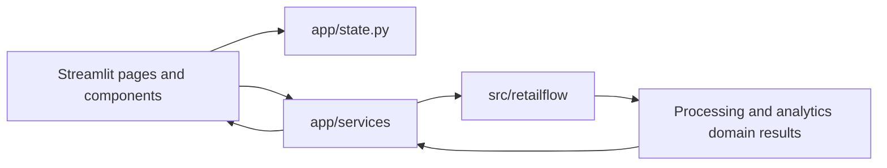

# RetailFlow Analytics UI Architecture Audit

## Scope and audit status

This document records the Streamlit UI as it exists before a redesign. It proposes a
future implementation sequence, but this commit does not change application behavior,
visual styling, navigation, services, state, analytics, validation, reporting, storage,
or CLI behavior.

The audit covers the repository state and Streamlit 1.60.0 configuration visible in
the current development environment.

## Current UI architecture

### Entry point and routing

The application entry point is `app/main.py`, launched with:

```bash
make run
```

`main()` calls `st.set_page_config()`, injects `app/styles.css`, initializes session
state, renders navigation, and dispatches the selected `AppPage` through an explicit
`if`/`elif` router. Exceptions reaching the entry point are logged and replaced with
a generic user-facing error.

The custom navigation registry is `NAVIGATION_ITEMS` in
`app/components/layout.py`. It is rendered as a sidebar `st.radio`. Page actions use
`navigate_and_rerun()`, which updates both the canonical `current_page` state value and
the `_retailflow_navigation` widget value before calling `st.rerun()`.

### Page modules

| Page | Module | Main responsibility |
| --- | --- | --- |
| Overview | `app/pages/overview.py` | Workflow introduction, new-report action, last-report summary |
| Upload Data | `app/pages/upload_data.py` | CSV/XLSX uploads and authenticated API loading |
| Data Quality | `app/pages/data_quality.py` | Pipeline execution, quality review, issue decisions and quality export |
| Dashboard | `app/pages/dashboard.py` | Shared filters, cached analytics result, KPIs, charts, tables and recommendations |
| Generate Report | `app/pages/generate_report.py` | Prerequisites, report form, generation progress and downloads |
| Run History | `app/pages/run_history.py` | Run filters, metadata details and historical report download |

`Settings` is present in the `AppPage` enum and custom navigation registry but has no
page module. The main router deliberately sends it to the shared placeholder renderer.
`app/pages/__init__.py` contains only a package docstring.

### Navigation implementations and duplication

There are two navigation systems active:

1. The application-owned sidebar radio in `app/components/layout.py`, backed by
   `AppPage`, `StateKey.CURRENT_PAGE`, and `_retailflow_navigation`.
2. Streamlit's legacy automatic multipage navigation, triggered because the entry
   script `app/main.py` has a sibling `app/pages/` directory containing Python files.

No `.streamlit/config.toml` exists. Streamlit therefore keeps
`client.showSidebarNavigation = true`, its default. The automatic page list and the
custom sidebar radio are consequently rendered together. This is the root cause of
the duplicated navigation; it is not caused by page-level calls to `st.sidebar`.

The page files are renderer modules rather than standalone Streamlit scripts, so the
application-owned router should remain the navigation authority. A future UI commit
should disable automatic sidebar discovery through supported Streamlit configuration
instead of hiding it with generated CSS selectors.

### Shared UI components

| Component | Module |
| --- | --- |
| Navigation, CSS loading, placeholder and rerun navigation | `app/components/layout.py` |
| Shared page title and workflow context | `app/components/header.py` |
| Status badge | `app/components/status_badge.py` |
| Empty state | `app/components/empty_state.py` |
| Generic metric | `app/components/metric_card.py` |
| Dashboard filters | `app/components/filter_bar.py` |
| Dashboard KPI card | `app/components/kpi_card.py` |
| Plotly dashboard charts | `app/components/charts.py` |
| Recommendation cards | `app/components/recommendation_card.py` |
| Quality metrics, groups and details | `quality_summary.py`, `issue_group.py`, `issue_table.py` |
| Processing progress | `app/components/processing_progress.py` |
| Report form, progress and result | `report_settings.py`, `report_progress.py`, `report_result.py` |

Pages generally compose these presentation helpers and call `app/services`; they do
not reproduce core retail calculations.

### Service and workflow boundaries



| Service | Existing boundary that must be preserved |
| --- | --- |
| `api_source_service.py` | Wraps `RetailApiClient` and returns loaded datasets/source summaries |
| `processing_service.py` | Adapts session inputs to the central pipeline, progress, quality grouping and quality workbook |
| `dashboard_service.py` | Calls existing analytics modules and returns one immutable, consistently filtered `DashboardResult` |
| `report_service.py` | Checks workflow prerequisites, validates report requests, invokes Excel reporting and updates run history |
| `run_history_service.py` | Wraps repository access, filters domain records and reads available report files |

The Dashboard page caches `calculate_dashboard()` through `_cached_dashboard()` using
DataFrames and immutable filter values, not the mutable session-state object.

### Session state

`app/state.py` is the canonical state registry. Its `StateKey` values are:

- navigation: `current_page`;
- source preparation: `loaded_datasets`, `column_mappings`, `import_settings`;
- processing: `validation_result`, `processing_result`, `issue_actions`,
  `warnings_confirmed`;
- analytics: `sales_analytics`, `inventory_analytics`, `returns_analytics`,
  `recommendations`, `active_filters`;
- reporting: `report_settings`, `generated_report`, `last_successful_run`,
  `selected_reporting_period`;
- shell state: `application_status`, `confirm_new_report`.

The custom navigation widget also uses `_retailflow_navigation`, defined in
`app/components/layout.py` rather than in `StateKey`. Dashboard widgets use stable
keys beginning with `dashboard_filter_`; Run History uses `history_period`,
`history_started`, and their `_enabled` flags. Upload widgets and form widgets are
managed by Streamlit.

`reset_temporary_state()` intentionally retains report settings and the last generated
report. `reset_application_state()` optionally retains the generated report, last run,
and report settings. UI work must not change those semantics.

### CSS and theming

The only application stylesheet is the global `app/styles.css`. It is read by
`load_local_css()` and rendered as one trusted `<style>` block with
`unsafe_allow_html=True`. There is no page-specific CSS and there are no other raw HTML
fragments in `app/`.

The stylesheet currently:

- defines four CSS variables for navy, blue, background and border;
- forces `stAppViewContainer` to a light gray background;
- adds top and bottom padding to `stMainBlockContainer`;
- forces headings to navy;
- gives metrics and bordered vertical containers white backgrounds;
- adds metric borders/padding and button corner radii.

There is no committed `.streamlit/config.toml`, no configured Streamlit theme, and no
remote font or icon dependency. Docker configures only headless/server settings.

### Plotly locations

All browser Plotly figure creation is centralized in `app/components/charts.py`.
It uses Plotly Express for line, bar and donut charts and applies a shared
`plotly_white` template, color sequence, margins and hidden Plotly logo. The service
layer in `app/services/dashboard_service.py` prepares chart DataFrames but does not
create figures. `src/retailflow/reporting/chart_builder.py` creates Excel charts and is
separate from the Streamlit/Plotly UI.

### Existing UI test coverage

There are no tests that render a Streamlit page, inspect the application shell, or
assert navigation/theme behavior. Existing relevant tests cover browser-independent
state and services:

- `tests/unit/app/test_state.py` — initialization, reset and navigation state;
- `tests/unit/app/test_processing_service.py` — pipeline storage, quality categories,
  blockers and quality workbook;
- `tests/unit/app/test_dashboard_service.py` — options, filters, shared results,
  comparisons and empty results;
- `tests/unit/app/test_report_service.py` — prerequisites, validation, generation,
  selected sections and failures;
- `tests/integration/test_run_history.py` — report/run persistence and missing files;
- `tests/integration/test_mock_api.py` and ingestion tests — API behavior used by the
  Upload page.

No test currently imports a page renderer or `app/main.py`. A later visual commit
should add focused Streamlit `AppTest` coverage for shell/navigation and critical
workflow guards without duplicating service tests.

## Problems found and root causes

### Light text on a light background

The global CSS overrides only selected backgrounds and headings. It does not define
the normal text, caption, label, input, sidebar, or widget colors. With no committed
Streamlit theme, the browser may retain Streamlit's dark theme and provide light text
tokens. `app/styles.css` then independently forces the application canvas and cards to
light colors. The result is dark-theme text on a forced light background.

The fix should be a complete, explicit Streamlit light theme plus matching local
tokens, not isolated `color` overrides on every widget.

### Duplicated navigation

`app/pages/` activates Streamlit's automatic sidebar navigation while
`render_navigation()` creates another sidebar navigation. Because
`client.showSidebarNavigation` is not configured, its default is `true`. This is the
direct root cause.

### Excessive vertical spacing

Several effects accumulate:

- `stMainBlockContainer` adds 2 rem above and 3 rem below the whole page;
- every page renders the shared caption/title/description plus a three-column context
  row before page content;
- page modules then add additional headings, captions, dividers, containers and
  Streamlit's default block gaps;
- Overview adds three explicit `st.divider()` calls;
- Dashboard renders four separate two-column chart rows and captions below every KPI;
- report and issue views stack multiple metrics, tables, expanders and action rows.

There is no shared section-spacing primitive, so each page compounds Streamlit's
defaults independently.

### Inconsistent button styling

The stylesheet changes only border radius. It does not define a coherent primary,
secondary, download, disabled, hover, focus, height or full-width policy. The code
mixes:

- `type="primary"` and default buttons;
- buttons with `width="stretch"` and content-width buttons;
- `st.button`, `st.form_submit_button`, and `st.download_button`;
- actions placed directly or through differently sized column layouts.

Streamlit therefore applies different native variants and dimensions. Styling by
generated class names would be fragile; future work should standardize component
usage first and use supported theme/configuration hooks.

### Visible Streamlit chrome

No Streamlit client/toolbar configuration is committed and the CSS does not address
the header or toolbar. Streamlit therefore uses `client.toolbarMode = "auto"` and
shows its normal header, toolbar/menu, deployment controls, and error-help links when
applicable. A future shell commit should prefer supported configuration such as a
minimal toolbar and disabled automatic sidebar navigation, rather than hiding chrome
with generated class selectors.

### Additional consistency findings

- The Overview page labels REST API as “Planned,” although API loading is implemented
  on Upload Data. This is content drift, not a missing service.
- The navigation registry stores icons but the current radio renders only page labels.
- The shared header repeats three context values on every page, even when all values
  are empty, contributing to visual weight.
- `Settings` appears as a navigation destination although it is only a placeholder.
- Plotly uses a fixed light template, while the surrounding Streamlit theme is not
  fixed; chart and shell colors can therefore disagree.

## Target application shell

The target remains a single Streamlit application with existing page functions and
services:

1. `app/main.py` owns page configuration, CSS loading, state initialization and error
   boundary.
2. One application-owned sidebar contains product identity, workflow navigation and
   compact current status. Streamlit's automatic pages navigation is disabled through
   configuration.
3. A compact shared page header contains title, description and only useful workflow
   context.
4. A consistent content container provides one spacing rhythm for sections.
5. Pages compose reusable cards, sections, action bars, empty states, tables and
   charts while continuing to call the current service layer.
6. Streamlit chrome is reduced through supported configuration. No remote assets,
   JavaScript frontend, React layer, or generated-class-only selectors are introduced.

## Proposed reusable components

These are future presentation abstractions; none are implemented by this audit:

- `render_app_shell()` — sidebar identity, navigation and page dispatch composition;
- `render_page_header()` revision — compact title/context with optional fields;
- `render_section()` — consistent title, caption and spacing contract;
- `render_action_bar()` — primary, secondary, download and destructive action order;
- `render_summary_cards()` — responsive metric groups for quality/report/history;
- `render_data_table_section()` — heading, empty state, dataframe and optional download;
- `render_filter_panel()` — consistent filter grouping, active count and reset action;
- `render_workflow_stepper()` — read-only Upload → Quality → Dashboard → Report state;
- existing empty-state, status, progress, recommendation and chart helpers refined
  rather than duplicated.

Business data preparation must remain in services; these components accept prepared
view models or domain results only.

## Proposed theme tokens

The redesign should define the Streamlit light theme in local configuration and mirror
the same values as CSS variables. Values below are a proposal, not current styles.

| Token | Proposed value | Purpose |
| --- | --- | --- |
| `color.canvas` | `#F6F8FB` | Main application background |
| `color.surface` | `#FFFFFF` | Cards, forms and tables |
| `color.surfaceMuted` | `#EEF2F7` | Sidebar and secondary panels |
| `color.text` | `#172033` | Primary text |
| `color.textMuted` | `#5D687A` | Captions and secondary text |
| `color.primary` | `#2457A7` | Primary actions and active navigation |
| `color.primaryHover` | `#1D478A` | Primary hover state |
| `color.border` | `#D7DEE8` | Dividers and card borders |
| `color.success` | `#18794E` | Completed/positive state |
| `color.warning` | `#8A6100` | Review-required state |
| `color.danger` | `#B42318` | Blocking/failed state |
| `color.focus` | `#2F6FED` | Keyboard focus ring |
| `space.*` | `4, 8, 12, 16, 24, 32, 48 px` | Shared spacing scale |
| `radius.sm/md` | `6 px / 10 px` | Inputs and cards |
| `font.family` | local system sans-serif stack | No remote font dependency |

Every text/background pair must meet WCAG AA contrast. Plotly colors should derive
from the same local palette, with labels or patterns where color alone is insufficient.

## Page-by-page implementation order

Each item should remain a separate future commit or reviewable slice. This audit stops
before item 1.

1. **Application shell:** add local Streamlit theme/config, disable automatic page
   navigation, reduce supported chrome, establish tokens, and test single navigation.
2. **Shared components:** header, section spacing, actions, status, metrics and empty
   states; preserve existing function signatures where practical.
3. **Overview:** remove redundant spacing, correct implemented-source copy, clarify
   start/continue actions and last-report summary.
4. **Upload Data:** unify file/API panels, source summaries and forward action without
   changing ingestion or token handling.
5. **Data Quality:** organize summary, issue groups/details and decision bar while
   preserving blockers, warning confirmation and issue actions.
6. **Dashboard:** consolidate filters, KPI cards, Plotly theme, charts, tables and
   recommendations around the existing single `DashboardResult`.
7. **Generate Report:** group prerequisites, form sections, progress, result metadata
   and downloads without changing report settings or lifecycle.
8. **Run History:** align filters, table, details and missing-report state without
   changing repository access.
9. **Responsive/accessibility pass:** keyboard focus, narrow layouts, contrast, empty
   states and Streamlit `AppTest` regression coverage.

## Session-state risks

- The custom radio widget and `StateKey.CURRENT_PAGE` must remain synchronized before
  reruns. Removing or renaming `_retailflow_navigation` without migration can leave a
  stale selection.
- Disabling native navigation changes visible routing, so every cross-page action must
  continue to call `navigate_and_rerun()` rather than relying on page URLs.
- Widget keys persist independently from domain state. Moving filters/forms between
  containers must not accidentally reuse a key with a different widget type.
- Dashboard reset writes widget keys before rerun; changing key names can break reset
  behavior or retain stale selections.
- New-report reset must continue to preserve the last report and configured settings
  while clearing temporary processing and analytics state.
- Warning confirmation and per-issue actions are report prerequisites. Visual
  reorganization must not clear or bypass them.
- Cached dashboard calculations must continue to use stable DataFrame/filter inputs,
  not the mutable session-state mapping.
- Uploaded API tokens must remain widget/request-local and must not be copied into
  `IMPORT_SETTINGS`, logs, or run history.
- Streamlit automatically owns form and upload widget state. A shell refactor must be
  checked against rerun behavior after validation and report generation callbacks.

## Files expected to change in future UI commits

The exact set should be narrowed per commit. Likely UI-only files are:

- new `.streamlit/config.toml`;
- `app/main.py`;
- `app/styles.css`;
- `app/components/layout.py`, `header.py`, `status_badge.py`, `empty_state.py`,
  `metric_card.py`, `kpi_card.py`, `filter_bar.py`, `charts.py`, and action-oriented
  report/quality components;
- the six modules under `app/pages/`;
- new page/shell-focused tests under `tests/unit/app/` or `tests/integration/`;
- README screenshots/documentation only after real assets exist.

The redesign should not require edits to `src/retailflow` or `app/services`. If a UI
need appears to require such a change, it should be reviewed separately rather than
folded into styling work.

## Functionality that must remain untouched

- CSV, XLSX, byte-stream, uploaded-file and REST API ingestion behavior;
- bearer-token handling, pagination, retry, timeout and redaction behavior;
- column normalization, aliases, ambiguity handling and manual mappings;
- all structural validation, business rules, issue severities and quality scoring;
- cleaning, duplicate strategies, currency conversion and excluded-row behavior;
- merge cardinality safeguards and traceability fields;
- all sales, returns, comparison and inventory formulas and rounding;
- recommendation rules, thresholds, severity and rule identifiers;
- Excel workbook content, formatting, charts, overwrite and temporary-file behavior;
- run-history schema, IDs, statuses, transactions, filtering and secret removal;
- CLI commands, output, strict mode and exit codes;
- service-layer public APIs and `StateKey` values;
- report prerequisites, warning confirmation, issue decisions and reset semantics;
- dashboard cache inputs and consistent filtering across KPIs, charts, tables and
  recommendations.

## Audit conclusion

The application already has a useful separation between Streamlit presentation,
application services and the core package. The visual defects come primarily from an
incomplete theme override and two simultaneous navigation systems, not from the
business workflow. The safest redesign starts with supported Streamlit configuration
and shared shell primitives, then updates pages incrementally while leaving services,
state semantics and core calculations unchanged.
